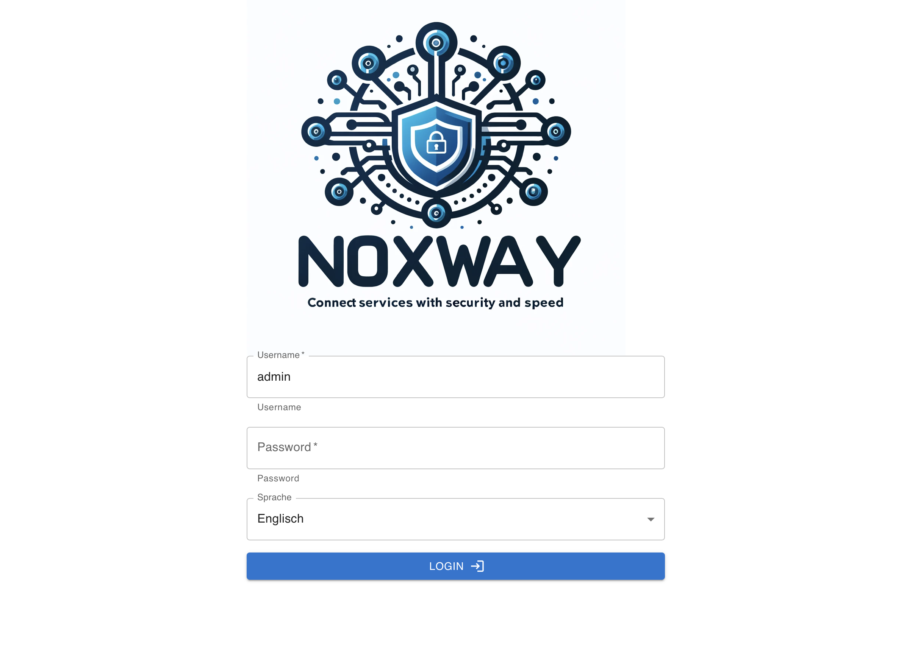
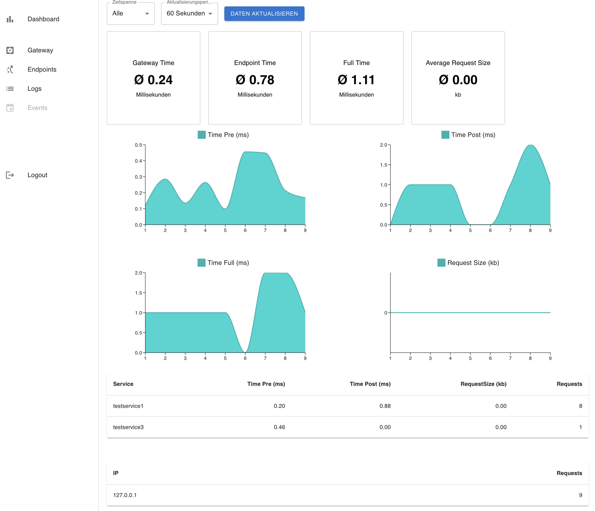
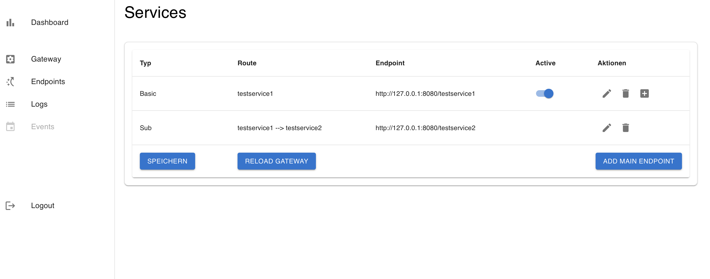
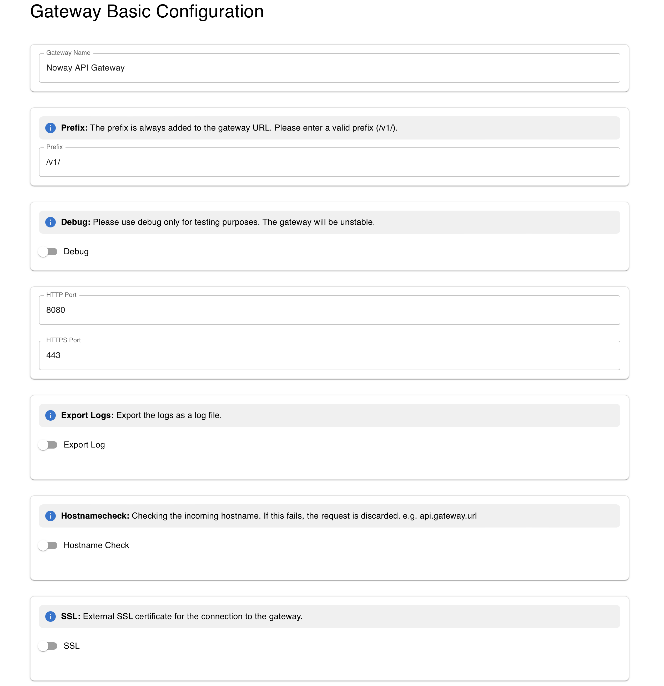

# noxway
Super-fast, efficient API gateway written in Go & React/TS

**Attention: Currently not stable**

# Todo
* Translation
* Endpoint Basic Auth
* ~~Endpoint JWT Auth~~
* ~~Gateway Let's Encrypt Automatic Retrieve~~
* ~~Lets Encrypt Renewal~~
* Code Cleanup
* Tests
* ~~Deployment~~


# Test Deployment

1. Create docker-compose.yaml
2. Change MySql ROOT Password: `MYSQL_ROOT_PASSWORD: "changeme"`
3. Change JWT Secret Key: `JWTSECRET: "changeme"`
4. `NOXWAY_DB_PASSWORD="change_me_please" docker-compose up -d`
5. Set Admin Password and Whitelist:
```
curl -X POST -H "Content-Type: application/json" -d '{
    "password": "admin",
    "newpassword": "changeme",
    "whitelist": ["whitelist_admin_ip"],
    "dnswhitelist": ["whitelist_admin_dns"]
    }' http://127.0.0.1:8080/setAdmin
```
6. Open http://hosturl:8080/web
7. Configure gateway SSL


## Docker-Compose
```
version: '3.8'

services:
  app:
    image: 'noxway/noxway:0.0.3'
    ports:
      - "8080:8080"
      - "443:443"
      - "80:80"
    volumes:
      - ./noxway/certs:/app/certs
      - ./noxway/config:/app/config
      - ./noxway/log:/app/log
    environment:
      JWTSECRET: "changeme"
      DATABASE: "noxway:${NOXWAY_DB_PASSWORD}@tcp(db:3306)/noxway?charset=utf8&parseTime=True&loc=Local"
    restart: unless-stopped
    depends_on:
      - db
   

  db:
    image: mariadb:latest
    environment:
      MYSQL_ROOT_PASSWORD: "changeme"
      MYSQL_DATABASE: noxway
      MYSQL_USER: noxway
      MYSQL_PASSWORD: ${NOXWAY_DB_PASSWORD}
    volumes:
      - ./noxway/db_data:/var/lib/mysql
      - ./initdb:/docker-entrypoint-initdb.d
    restart: unless-stopped

volumes:
  db_data:
  ```

# Screens









